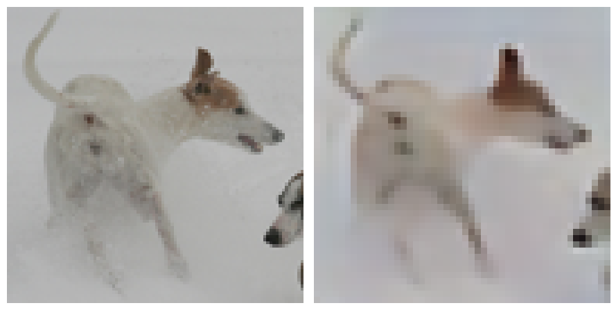
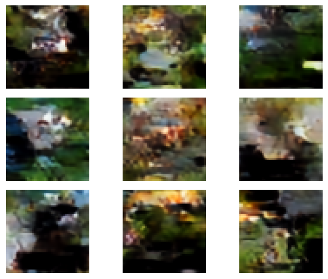

Been a while since I posted, which I guess is what happens when you [have a child](../baby-1).  The little guy is almost a year old, and wondering why he's been born to a man who hasn't updated his blog in many months, so here I am fulfilling my duty as a father and revisiting some old business.

Previous posts on here ended in a bit of uncertainty or disappointment, specifically [Lunar Lander PPO](../ppo/index.qmd) and [VQ-VAE](../vqvae/vqvae.qmd).  PPO 'worked', and VQ-VAE.....did a little better.  This is the kind of thing that AI is nice for.  I can just point Claude at my noteook/blog post and ask "ehhhhh, anything wrong with this?".  Sure enough it came back with some fixes/changes that I was eager to try out.  It also helped immensely to spin up a [simple repo](https://github.com/clabornd/vqvae) to launch remote training jobs for the VQ-VAE and auxiliary models using [skypilot](https://docs.skypilot.ai/en/latest/docs/index.html) and [lambda](https://lambda.ai) for cloud compute, as I was getting a bit tired of running things in Google Colab.

I think AI is incredibly useful for this type of experimentation/personal project, especially if you have limited free time and sleep for some reason.  My main tension is of course the 'slopification' of codebases, as well as the feeling of getting dumber as I put in progressively lazier prompts to *make the thing go*.  I do have to exert some mental effort to not get addicted to doing vibes-only coding and actually reviewing the code, but I think there is a good balance in there somewhere, and as long as I can pay 40 bucks a month for such a service, I am going to.  Now, on to the topics of the day.

## PPO

My PPO implementation for the lunar lander gym environment produced successful agents that essentially guided the lunar lander to the surface every episode.  I was later looking around to see if the use of a replay buffer was standard for PPO.  While the answer seemed to be *no*, PPO training inherently uses 'old' data, in the sense that it is making updates using data generated from a previous policy, so a replay buffer it just kinda doing this more.  In this way PPO is very much *off-policy*.  

Now, Googling 'is PPO an on-policy algorithm' will give you the answer 'Yes, PPO is an on-policy reinforcement learning algorithm'.  And indeed OpenAI's 'spinning up' resources will tell you the same.  Now, I'm just some guy, but I feel the need to call bullshit on this.  In my studying of reinforcement learning, the distinction between on and off-policy seemed to be very flexible.  Often asking:  "why is [algorithm x] on/off-policy" will get you an answer that just gives some description that can easily be broken by any number of decisions about how the policy is trained.  On/off policy is a concept/vibe, not a mathematical definition, and I think just calling PPO on-policy and refusing to elaborate further is flat wrong....Anyway:

Claude also came back with the following suggestions/mistakes:
    - Normalize the advantages
    - Stop using epsilon-greedy exploration.  This is non-standard for PPO, as it already explores via its stochastic policy.
    - Perform gradient clipping as well as the 'PPO clipping' on the value estimate
    - I was padding computation of the TD residuals with a zero, when it should be padded with a value estimate for the last state when it is not terminal.

Sure, I'll try these.

Ok, so I'm using a replay buffer, which is a bit non-standard, but my janky implementation *worked*, and as I mentioned before, this is not fundamentally different that running a bunch of minibatches over sampled episodes.  Still, there has to be a limit right?  At what point does the data sampled via the old policy become too stale?

I decided to test this by sweeping over a bunch of different buffer sizes, while keeping the total number of gradient updates the same.  The only difference then should be how 'fresh' the data is.

***

One always hopes the results show this nice, ordered effect, which as always, was not the case here.  The plot below shows a rolling average reward grouped by buffer size.  The lowest buffer size, where the data is freshest, shows the worst average performance and the highest variance.  It had one of the worst runs as well as one of the best, as measured by how long it takes to produce a consistently successful agent.

Next is a buffer size of 10,000, which on average produced the best results.  The remaining:  20K, 40K, and 80K buffer sizes get progressively worse.  Good science involves taking some empirical results and finding a hand-wavy story that fits those results:  You do need a sufficiently large pool of observations so that there is good variety/less correlation in the training data, but there is a point at which every unit of increased variety in the data comes at a greater cost of data staleness.

<iframe src="https://wandb.ai/clabornd/ppo-rewrite/reports/PPO-Buffer-Size-Experiment--VmlldzoxNzYzODU0Mg" style="border:none;height:1024px;width:100%"></iframe>

## VQ-VAE

This project was far, *far* more poorly implemented.  Two big mistakes: 

1. The padding in two of the convolutional layers of the model were mis-specified.
2. I was dividing by the wrong denominator when reducing the KL loss calculation
3. During inference, I was still using the softmax operator to construct codebook values.  Switching to actual argmax during inference is standard.
4. I completely missed the part of the Dall-E paper where they had to train a completely separate model to learn the prior.  The prior learned by the VQVAE during training has no shot of being good.

For training the encoder-decoder architecture, 1. and 2. helped me out a lot.  I was getting frustrated because my deep learning knowledge suggested I should be able to *very* accurately reconstruct at least the training images if I trained for long enough, but I was still getting pretty blurry reconstructions.  These fixes allowed me to get the below reconstructions of *training data*.  My wife congratulated me on getting great definition of the dogs butthole:

The next failure was just completely missing the part of the Dall-E paper @ramesh_zero-shot_2021 where they trained a separate transformer model to learn the prior for generation.  The basic argument is that the uniform categorical prior assumed in the KL divergence term during training is pretty much just a regularization term that pushes the model to use more of the codebook (closer to a uniform categorical).

If you recall, the encoder outputs a probability distribution over codebook entries per 'pixel' in the bottleneck layer.  The KL term encourages this per-pixel conditional distribution to be close to a uniform categorical.  However the final conditional distribution is likely to not be very close.  Moreover, if you sample from a uniform categorical independently per pixel, you are ignoring some amount of spatial correlation present in images.  Their solution is to train a transformer model to learn the prior.  This is essentially an image transformer over the latent space of the VQVAE.  My implementation uses class-conditioning to hopefully improve generation.

The result is not particularly impressive (no dog buttholes, sorry), but is somewhat mesmerizing:

It is likely there is simply not enough training data in STL-10 to learn a prior that is going to generate realistic looking images.  The code to train the vq-vae and prior via skypilot+lambda is [here](https://github.com/clabornd/vqvae)

<!-- June 19th is the first 'good' version of VQ-VAE, if all else fails revert to that one. -->
<!-- Possible debug scenario is that I trained it for more epochs, but it didnt reflect in the notebook -->
